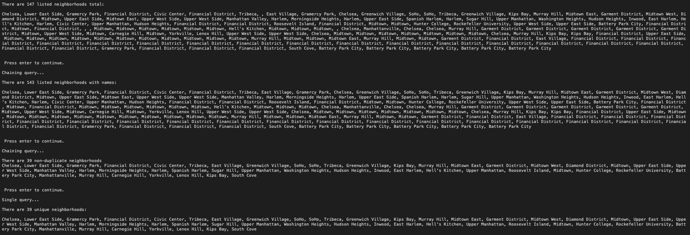

# LINQ

Lab09-LINQ

*Author: Enrique Hilst*

----

## Description

This is a C# console application that will query the data.json file to filter the data. 

---

### Getting Started
Clone this repository to your local machine.

```
$ git clone https://github.com/ehilst515/LINQ.git
```

### To run the program from Visual Studio:
Select ```File``` -> ```Open``` -> ```Project/Solution```

Next navigate to the location you cloned the Repository.

Double click on the ```LINQ``` directory.

Then select and open ```LINQ.sln```

---

### Visual



